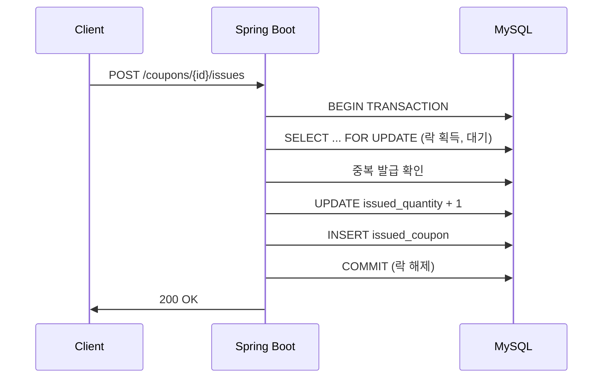
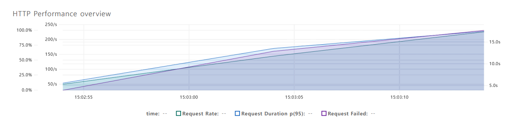
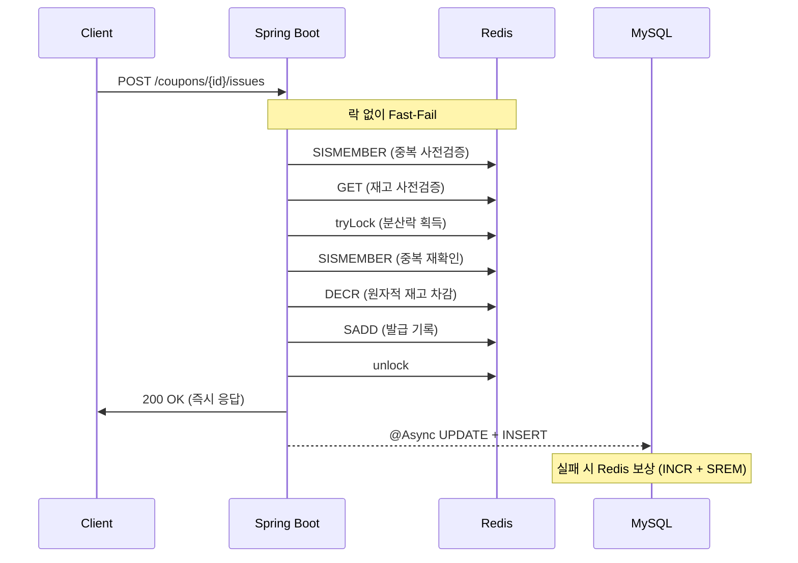
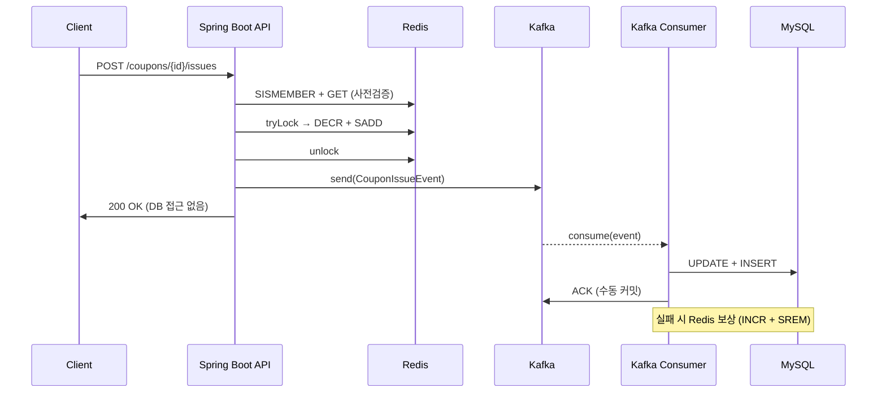
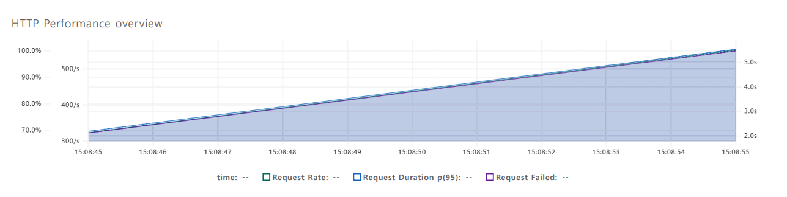

# CouponRush

선착순 쿠폰 발급 시스템 — 동일한 비즈니스 로직을 3가지 아키텍처로 구현하여 동시성 제어 방식에 따른 성능 특성을 비교한다.


> "동시에 3,000명이 1,000장의 쿠폰을 요청할 때, 아키텍처에 따라 정확성, 응답 속도, 처리량이 어떻게 달라지는가?"

## 시나리오 비교 결과

3,000명 동시 요청, 1,000장 한정, 10초 스파이크 테스트 (로컬 환경 기준):

| 지표 | Scenario 1 (DB) | Scenario 2 (DB+Redis) | Scenario 3 (DB+Redis+Kafka) |
|------|:---:|:---:|:---:|
| **발급 정확성** | 1,000/1,000 | 1,000/1,000 | 1,000/1,000 |
| **에러율** | 0% | 0% | 0% |
| **총 처리 요청** | 4,390 | 10,425 | 10,190 |
| **처리량 (req/s)** | 147 | 425 | 404 |
| **평균 응답 시간** | 11.34s | 3.53s | 3.44s |
| **p95 응답 시간** | 15.39s | 5.81s | 6.32s |
| **성공 응답(200) 평균** | 5.4s | 2.76s | **559ms** |

**핵심 개선 포인트:**

- **Scenario 1 → 2:** Redis 도입으로 처리량 **3배** 향상 (147 → 425 req/s). DB 락 대기가 제거되면서 대부분의 요청을 빠르게 처리.
- **Scenario 2 → 3:** 성공 응답 속도 **5배** 향상 (2.76s → 559ms). Kafka가 DB 쓰기를 API 스레드에서 완전히 분리하여 사용자 체감 응답 시간이 크게 개선.

---

## Scenario 1: RDBMS 병목 분석

### 문제 발견

락 없이 `SELECT` → `UPDATE`를 수행하면 TOCTOU(Time-of-Check to Time-of-Use) Race Condition이 발생한다.

```
시간  Thread A                    Thread B                    DB (잔여: 1장)
─────────────────────────────────────────────────────────────────────────────
 t1   SELECT remaining → 1장
 t2                               SELECT remaining → 1장
 t3   remaining > 0 → 발급!
 t4   UPDATE remaining = 0
 t5                               remaining > 0 → 발급!       ← 이미 0장인데 통과
 t6                               UPDATE remaining = -1       ← 초과 발급
```

K6 스파이크 테스트에서 초과 발급과 중복 발급이 실제로 발생했다.

### 해결 방안 검토

| 방안 | 장점 | 문제점 |
|------|------|--------|
| UNIQUE 제약조건 | 중복 발급 방지 가능 | 초과 발급은 별도 처리 필요 |
| 낙관적 락 (Optimistic Lock) | 읽기 성능 유지 | 충돌 시 재시도 필요, 스파이크 상황에서 재시도 비용 폭증 |
| **비관적 락 (Pessimistic Lock)** | **조회-검증-갱신을 직렬화하여 Race Condition 원천 차단** | **처리량 저하, DB 부하 집중** |

낙관적 락도 먼저 구현해 봤는데, 3,000명 스파이크에서는 충돌률이 너무 높아 재시도가 꼬리를 물었다. 재시도 폭풍을 피하려면 처음부터 직렬화하는 게 낫다고 판단해 비관적 락으로 바꿨다.

### 적용: `SELECT ... FOR UPDATE`

`SELECT ... FOR UPDATE`로 쿠폰 행에 배타적 락을 걸어, 한 트랜잭션이 완료될 때까지 다른 트랜잭션의 접근을 차단한다.



### 핵심 코드

```java
// PessimisticLockStrategy.java
@Transactional(isolation = Isolation.READ_COMMITTED, timeout = 3)
public IssueCouponResponse issueCoupon(Long couponId, Long userId) {
    // SELECT ... FOR UPDATE: 락 획득까지 대기
    Optional<Coupon> coupon = couponRepository.findByIdWithLock(couponId);
    if (coupon.isEmpty()) throw new CoreException(ErrorType.COUPON_NOT_FOUND);

    if (issuedCouponRepository.existsByUserIdAndCouponId(userId, couponId)) {
        throw new CoreException(ErrorType.COUPON_ALREADY_ISSUED);
    }

    // WHERE issued_quantity < total_quantity 조건으로 초과 발급 원천 차단
    int updated = couponRepository.increaseIssuedQuantity(couponId);
    if (updated == 0) throw new CoreException(ErrorType.COUPON_SOLD_OUT);

    issuedCouponRepository.save(new IssuedCoupon(userId, couponId));
    return new IssueCouponResponse(1);
}
```

```sql
-- JdbcCouponRepository.java
-- 배타적 락 획득
SELECT id, total_quantity, issued_quantity FROM coupons WHERE id = ? FOR UPDATE

-- 조건부 UPDATE: issued_quantity < total_quantity 로 초과 발급 원천 차단
UPDATE coupons SET issued_quantity = issued_quantity + 1, updated_at = ?
WHERE id = ? AND issued_quantity < total_quantity
```

### 테스트 결과

| 지표 | 값 |
|------|:---:|
| 발급 정확성 | 1,000/1,000 |
| 처리량 | 147 req/s |
| 평균 응답 시간 | 11.34s |
| p95 응답 시간 | 15.39s |

발급 정확성은 유지됐다. MySQL 2cpu/2ram 기준 TPS 약 147.



### 남은 병목

- 모든 요청이 **DB 단일 행의 락을 순차적으로 대기** → 처리량 병목
- 트랜잭션 내에서 락 획득 → 검증 → 갱신 → 저장을 모두 수행 → 락 보유 시간이 길어짐
- 재고가 소진된 이후에도 락을 잡아야 "매진"을 알 수 있음 → 불필요한 대기

---

## Scenario 2: Redis 도입으로 DB 병목 해소

### 이전 문제

Scenario 1은 재고 확인, 재고 차감, 발급 기록 저장이 전부 하나의 트랜잭션에 묶여 있었다. 모든 동시성 제어가 DB에 몰리다 보니 락 보유 시간이 길었고, 재고가 이미 소진된 요청도 락을 잡아봐야 매진 여부를 알 수 있었다.

### 개선 방향

병목을 두 방향에서 해소했다.

**사전검증으로 Fast-Fail**

분산락을 잡기 전에 `GET`과 `SISMEMBER`로 재고 소진과 중복 여부를 먼저 확인한다. 이미 매진된 후의 요청은 락 경합 없이 바로 반려되므로, 락 경쟁 자체가 줄어든다.

**DB 쓰기를 응답 경로 밖으로**

트랜잭션 안에서 DB까지 쓰는 게 락 보유 시간을 늘리는 주된 이유였다. Redis에서 재고 차감과 발급 기록을 마친 뒤 DB 저장은 `@Async`로 넘겨, API 스레드가 DB I/O를 기다리지 않도록 했다.

### 적용



### 핵심 코드: 분산락 + 사전검증

```java
// DistributedStrategy.java
public IssueCouponResponse issueCoupon(Long couponId, Long userId) {
    final String couponKey = "COUPON:" + couponId;
    final String userCouponSetKey = "ISSUED:" + couponKey;
    final String lockKey = "LOCK:USER:" + userId + ":COUPON:" + couponId;

    // 1단계: 락 없이 사전검증 (Fast-Fail)
    //   → 재고 소진/중복 발급이면 락 경합 없이 즉시 반려
    if (Boolean.TRUE.equals(redisTemplate.opsForSet().isMember(userCouponSetKey, userId.toString()))) {
        throw new CoreException(ErrorType.COUPON_ALREADY_ISSUED);
    }
    Integer remaining = (Integer) redisTemplate.opsForValue().get(couponKey);
    if (remaining == null || remaining <= 0) throw new CoreException(ErrorType.COUPON_SOLD_OUT);

    // 2단계: 사용자별 분산락 획득 (동일 사용자의 동시 요청만 직렬화)
    RLock lock = redissonClient.getLock(lockKey);
    try {
        if (!lock.tryLock(3, TimeUnit.SECONDS)) {
            throw new CoreException(ErrorType.LOCK_ACQUISITION_FAILED);
        }

        // 3단계: 락 안에서 중복 재확인 (Double-Checked Locking)
        if (Boolean.TRUE.equals(redisTemplate.opsForSet().isMember(userCouponSetKey, userId.toString()))) {
            throw new CoreException(ErrorType.COUPON_ALREADY_ISSUED);
        }

        // 4단계: 원자적 재고 차감 + 발급 기록
        Long quantity = redisTemplate.opsForValue().decrement(couponKey);
        if (quantity < 0) {
            redisTemplate.opsForValue().increment(couponKey); // 즉시 복구
            throw new CoreException(ErrorType.COUPON_SOLD_OUT);
        }
        redisTemplate.opsForSet().add(userCouponSetKey, userId.toString());

    } catch (InterruptedException e) {
        throw new CoreException(ErrorType.LOCK_ACQUISITION_FAILED);
    } finally {
        if (lock.isHeldByCurrentThread()) lock.unlock();
    }

    // 5단계: DB 저장은 별도 빈(@Async)에 위임
    //   → 같은 클래스에서 this.asyncMethod()를 호출하면 Spring AOP 프록시를 우회해 동기 실행됨
    //   → AsyncCouponSaver를 별도 빈으로 분리하여 프록시가 정상 동작하도록 보장
    asyncCouponSaver.save(userId, couponId, couponKey, userCouponSetKey);
    return new IssueCouponResponse(1);
}
```

### 테스트 결과

| 지표 | 값 | 변화 |
|------|:---:|:---:|
| 발급 정확성 | 1,000/1,000 | - |
| 처리량 | 425 req/s | +189% |
| 평균 응답 시간 | 3.53s | -69% |
| 성공 응답 평균 | 2.76s | -49% |

Redis 1cpu/1ram을 추가했을 뿐인데 DB 직렬 처리가 인메모리 연산으로 대체되면서 TPS가 2배 이상 올랐다.


### 트레이드오프

다만 Redis를 끼워 넣으면서 신경 써야 할 것들이 생겼다.

**Redis-DB 정합성 — 보상 처리**

비동기 DB 저장이 실패하면 Redis에는 발급됐다고 남아 있지만 DB에는 없는 불일치가 생긴다. 실패 시 Redis 재고를 되돌리는(`INCR` + `SREM`) 보상 처리가 필요한 이유다.

```java
// AsyncCouponSaver.java
@Async
@Transactional
public void save(Long userId, Long couponId, String couponKey, String userCouponSetKey) {
    try {
        // DB에 이미 존재하는 경우 (중복): Redis 보상 후 종료
        if (jdbcIssuedCouponRepository.existsByUserIdAndCouponId(userId, couponId)) {
            redisTemplate.opsForValue().increment(couponKey);          // 재고 복구
            redisTemplate.opsForSet().remove(userCouponSetKey, userId.toString()); // 발급 기록 제거
            return;
        }

        // 초과 발급 방지 조건(issued_quantity < total_quantity)에 걸린 경우: 보상 후 종료
        int updated = jdbcCouponRepository.increaseIssuedQuantity(couponId);
        if (updated == 0) {
            redisTemplate.opsForValue().increment(couponKey);
            redisTemplate.opsForSet().remove(userCouponSetKey, userId.toString());
            return;
        }

        jdbcIssuedCouponRepository.save(new IssuedCoupon(userId, couponId));

    } catch (Exception e) {
        // DB 오류(커넥션 실패, 타임아웃 등): 재고·발급 기록 복구
        redisTemplate.opsForValue().increment(couponKey);
        redisTemplate.opsForSet().remove(userCouponSetKey, userId.toString());
    }
}
```

보상 흐름 요약:

| 실패 시점 | 감지 방법 | 보상 동작 |
|----------|----------|---------|
| DB 중복 감지 | `existsByUserIdAndCouponId()` 반환 `true` | `INCR` (재고 복구) + `SREM` (발급 기록 제거) |
| `increaseIssuedQuantity()` 0건 | UPDATE affected rows = 0 | `INCR` + `SREM` |
| DB 예외 (커넥션, 타임아웃 등) | `catch(Exception e)` | `INCR` + `SREM` |

> 보상 Redis 연산 자체가 실패하면(Redis 장애) 불일치가 그대로 남는다. 운영 환경이라면 DLQ나 배치 정합성 검증을 별도로 두어야 한다.

**`@Async` 스레드풀 포화**

스파이크 시 스레드풀(`core=20, max=50, queue=500`)이 꽉 차면 `CallerRunsPolicy`로 API 스레드가 직접 DB를 쓰게 된다. 데이터 유실은 막히지만 그 요청의 응답이 느려진다. Scenario 3에서 Kafka로 대체해 이 문제를 없앴다.

---

## Scenario 3: Kafka 도입으로 API 스레드에서 DB 완전 분리

### 이전 문제

Scenario 2의 `@Async`는 스레드풀 기반이라 스파이크 시 포화될 수 있다.

스레드풀 설정은 `corePoolSize=20`, `maxPoolSize=50`, `queueCapacity=500`이다. 스파이크에서 1,000건의 성공 요청이 짧은 시간에 몰리면 큐(500) + 최대 스레드(50)를 금방 초과한다. 이때 `CallerRunsPolicy`가 작동해 API 스레드가 직접 DB INSERT/UPDATE를 처리하게 되고, 그 DB I/O 시간이 응답에 그대로 포함된다. 성공 응답 평균이 2.76s까지 올라간 주된 이유다.

### 개선 방향

`@Async` 스레드풀을 Kafka로 대체해 API 스레드에서 DB I/O를 아예 없앴다.

- **스레드풀 포화 해소** — Kafka `send()`는 내부 버퍼에 적재 후 바로 반환하므로 스레드풀 크기에 영향 받지 않는다.
- **수동 커밋** — `AckMode.RECORD`로 메시지 단위로 커밋. Consumer가 DB 저장을 마쳐야 오프셋을 커밋한다.

### 적용



### 핵심 코드: Kafka Consumer + 보상 처리

```java
// CouponIssueConsumer.java
@KafkaListener(topics = "coupon-issue-events", groupId = "coupon-issue-consumer")
@Transactional
public void consume(CouponIssueEvent event) {
    try {
        // DB 중복 확인: Redis-DB 불일치(재처리, 네트워크 지연)로 인한 중복 방지
        if (jdbcIssuedCouponRepository.existsByUserIdAndCouponId(event.userId(), event.couponId())) {
            redisTemplate.opsForValue().increment(event.couponKey());
            redisTemplate.opsForSet().remove(event.userCouponSetKey(), event.userId().toString());
            return;
        }

        // 초과 발급 방지 조건(issued_quantity < total_quantity)에 걸린 경우: 보상 후 종료
        int updated = jdbcCouponRepository.increaseIssuedQuantity(event.couponId());
        if (updated == 0) {
            redisTemplate.opsForValue().increment(event.couponKey());
            redisTemplate.opsForSet().remove(event.userCouponSetKey(), event.userId().toString());
            return;
        }

        jdbcIssuedCouponRepository.save(new IssuedCoupon(event.userId(), event.couponId()));

        // @Transactional 커밋 성공 후 AckMode.RECORD에 의해 오프셋 커밋
        // → DB 저장 실패 시 ACK를 보내지 않으므로 Kafka가 재전달

    } catch (Exception e) {
        // DB 예외: Redis 보상 후 반환 (오프셋은 커밋되지 않음 → Kafka 재전달)
        redisTemplate.opsForValue().increment(event.couponKey());
        redisTemplate.opsForSet().remove(event.userCouponSetKey(), event.userId().toString());
    }
}
```

### 테스트 결과

| 지표 | 값 | 변화 (vs Scenario 2) |
|------|:---:|:---:|
| 발급 정확성 | 1,000/1,000 | - |
| 처리량 | 404 req/s | 유사 |
| 평균 응답 시간 | 3.44s | 유사 |
| 성공 응답 평균 | **559ms** | **-80%** |

처리량이 Scenario 2와 비슷한 이유는, 두 시나리오 모두 API 스레드 병목이 Redis 연산(6회 왕복 + 분산락 대기)이기 때문이다. `@Async`든 `kafkaTemplate.send()`든 정상 상태에서는 바로 반환하므로 전체 처리량에는 차이가 없다.

성공 응답이 빨라진 건 Scenario 2의 스레드풀 포화 문제가 사라졌기 때문이다. Scenario 2에서는 스파이크 시 일부 API 스레드가 직접 DB를 써서 응답 시간이 늘어났는데, Kafka는 그 경로 자체가 없다. 성공 응답에서만 2.76s → 559ms로 줄어든 이유다.

teardown 시점에 DB 발급 수가 1,000 미만으로 찍힐 수 있는데, Kafka Consumer가 처리를 마치면 정확히 1,000개가 기록된다. Eventual Consistency 특성이다.



---

## 실행 방법

### 사전 요구사항

- Java 17
- Docker Desktop
- K6 (`k6 version`으로 설치 확인)

### 공통 준비

시나리오 전환 시 기존 컨테이너와 볼륨을 정리한다:

```bash
docker-compose --profile scenario1 --profile scenario2 --profile scenario3 down -v
```

### Scenario 1: DB only

```bash
# 인프라 (MySQL)
docker-compose --profile scenario1 up -d

# 앱 시작
./gradlew bootRun --args='--spring.profiles.active=scenario1'

# K6 부하 테스트 (별도 터미널)
k6 run k6/load-test.js
```

### Scenario 2: DB + Redis

```bash
# 인프라 (MySQL + Redis)
docker-compose --profile scenario2 up -d

# 앱 시작
./gradlew bootRun --args='--spring.profiles.active=scenario2'

# K6 부하 테스트
k6 run k6/load-test.js
```

### Scenario 3: DB + Redis + Kafka

```bash
# 인프라 (MySQL + Redis + Zookeeper + Kafka)
docker-compose --profile scenario3 up -d
# Kafka 안정화까지 약 15초 대기

# 앱 시작
./gradlew bootRun --args='--spring.profiles.active=scenario3'

# K6 부하 테스트
k6 run k6/load-test.js
```

### 주의사항

- 시나리오 전환 시 반드시 `docker-compose down -v`로 볼륨 포함 정리
- Kafka 리스너: Docker 내부 `kafka:9092` / 로컬 `localhost:29092`로 분리. 로컬 `bootRun`은 29092 포트로 접근

---

## 기술 스택

| 영역 | 기술 |
|------|------|
| Language | Java 17 |
| Framework | Spring Boot 3.5.6 |
| Persistence | JDBC (JdbcTemplate, ORM 없음) |
| Database | MySQL 8 |
| Cache / Lock | Redis 7, Redisson |
| Messaging | Kafka (Confluent 7.5.0) |
| Test | JUnit 5, Testcontainers |
| Load Test | K6 |
| Infra | Docker Compose |

## 프로젝트 구조

```
com.apeirogon.rush
├── api
│   ├── controller        # REST 엔드포인트 (CouponController)
│   └── config            # Spring 설정 (DataSource, Redis, Kafka, Async)
├── domain                # 도메인 레코드 (Coupon, IssuedCoupon)
├── storage               # JDBC 리포지토리 (raw SQL)
├── strategy              # Strategy 패턴으로 시나리오 분기
│   ├── PessimisticLockStrategy   # scenario1: DB 비관적 락
│   ├── DistributedStrategy       # scenario2: Redis + @Async
│   └── MessagingStrategy         # scenario3: Redis + Kafka
├── async                 # AsyncCouponSaver (@Async DB 저장)
├── messaging             # Kafka Producer/Consumer
└── support               # 에러 타입, API 응답 래퍼
```

## API

| Method | Endpoint | 설명 |
|--------|----------|------|
| `POST` | `/coupons` | 쿠폰 생성 (수량 지정) |
| `POST` | `/coupons/{couponId}/issues` | 쿠폰 발급 요청 (`{ userId }`) |
| `GET` | `/coupons` | 쿠폰 목록 조회 |
